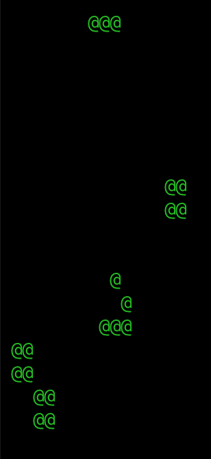

# clojure-conway-game-of-life

It runs into a weird out of bounds error w/ any grid that's not a square. So only supports NxN for now... 

Also I hardcoded a vector array that includes a glider and a few other oscilators. 

Tries to be almost purely functional, aside from drawing. 

